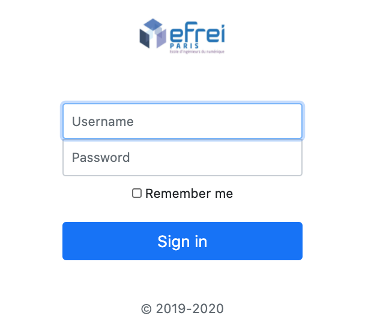
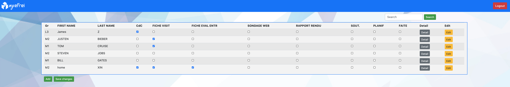
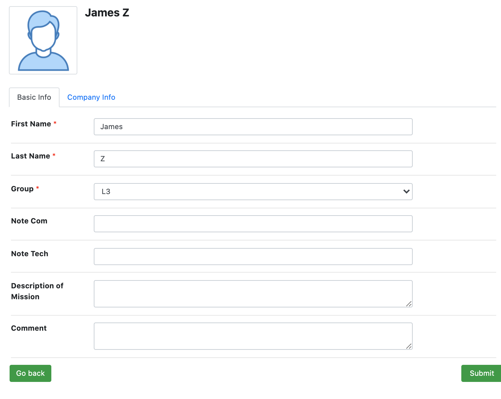

#README

Project of JEE lesson implemented with spring framework and hibernate to build a 
simple web page dedicated to professors which is capable to manage basic information about students internship.

## HOW TO SETUP THE PROJECT

### 1. Install the database

For this example, we are using a docker container with MYSQL.
This project is configured to work with MYSQL.

*Start the container :*

`docker run --name mysql -p 3306:3306 -e MYSQL_ROOT_PASSWORD=[your_root_password] -d mysql`

Add a new connection to your IDE.

*Then, execute these commands:*

`CREATE USER 'adm'@'%' IDENTIFIED BY 'adm'; `

`GRANT ALL PRIVILEGES ON * . * TO 'adm'@'%'; `

`FLUSH PRIVILEGES;`

Now, updated your IDE connection with the new credentials : adm/adm

Once it's done, open a query console ("execute command in NetBean") and run the script inside the **ST2EE.sql** file.
This file in on the project root folder.

### 2. Install the application server : TOMCAT

For the correct execution of Spring and Hibernate, TOMCAT is the optimal choice.
We tried TomEE and GlassFish but TOMCAT was the easiest application server to setup.

Download TOMCAT on the official website : *https://tomcat.apache.org/*

Configure TomCat on your IDE to run the project with a 1.8 JRE.

## RUN THE PROJECT

